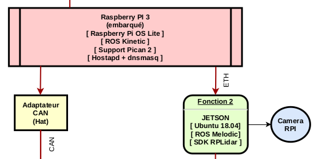

# Infos caméra

## Config
La caméra est connectée à la Jetson en USB, la Jetson en Ethernet à la Raspi.


## Test de la caméra
La caméra est branchée en USB et est censée être opérationnelle (si c’est pas le cas bonne merde). Pour la tester, on peut utiliser l’application `nvgstcapture`.

Les périphériques sont représentés comme des nœuds (nodes), qui consistent en des fichiers situés dans `/dev` (pour **dev**ices), et qui peuvent être utilisés pour manipuler les périphériques correspondants. La caméra est représentée par un fichier nommé `videoN`, où N est un numéro allant de 0 à 63. Normalement, il ne devrait n’y en avoir qu’un seul, du nom de `video0`. Pour vérifier, on peut lancer la commande :
```shell
ls /dev/video*
```
qui ne devrait retourner que `/dev/video0`, qui correspond donc à la caméra. On peut alors lancer la commande :
```shell
nvgstcapture-1.0 --camsrc=0 --cap-dev-node=N
```
où N est le numéro relevé plus haut, càd normalement 0. Une fenêtre devrait alors s’ouvrir, offrant un aperçu de l’image de la caméra. Si il y avait plusieurs appareils `videoN`, et que la commande précédente ne donne rien, on peut essayer les autres nombres jusqu’à avoir un résultat.

[Source du test](https://developer.nvidia.com/embedded/learn/tutorials/first-picture-csi-usb-camera)

## Traitement de l’image
Le traitement de l’image est effectué sur la Jetson, les données qui en sont issues sont ensuite rapatriées vers la Raspi.

